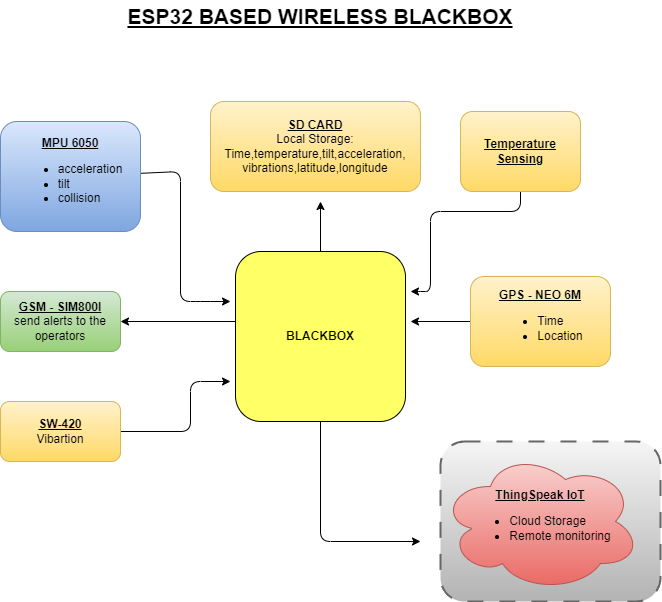
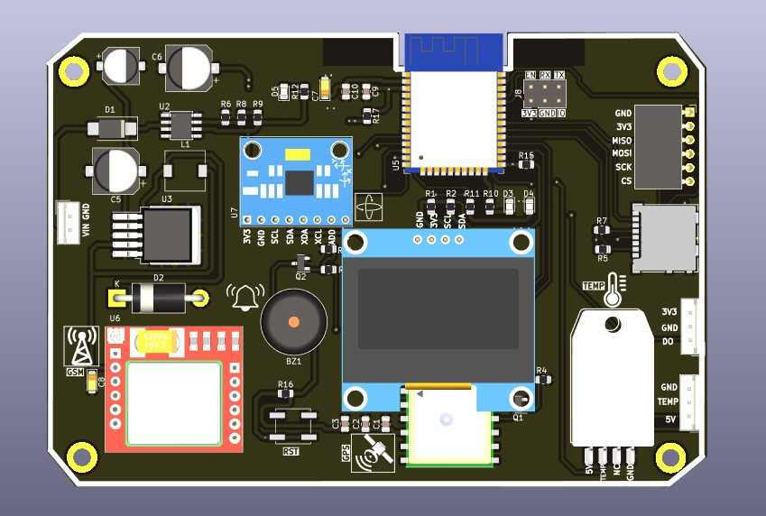
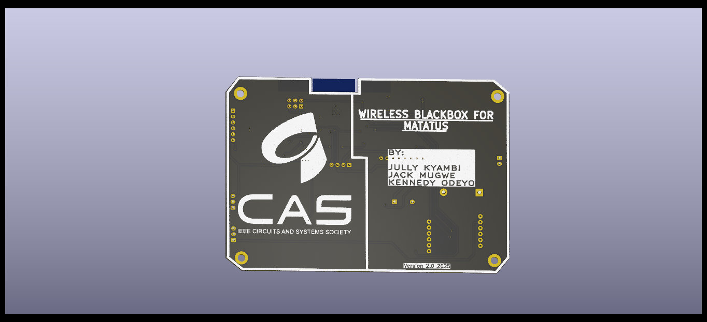
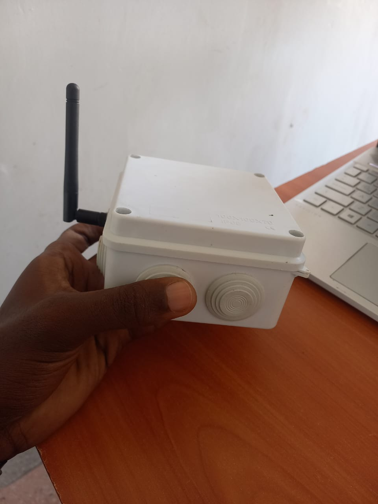

# 🚐 ESP32-Based Wireless Blackbox for PSV Monitoring

> A smart blackbox system designed for **Public Service Vehicles (Matatus)** in Kenya — monitoring critical parameters and sending real-time data to the cloud.

  
🔗 [Click here to watch the full demo](https://youtu.be/Tre0SZ3siGg?si=uvzTk_H2zi13TlJX)

---

## 🧭 Description

This project implements a **wireless blackbox system** using the **ESP32-S3** microcontroller. It is tailored for **public transport operators**, particularly *Matatu* fleets, enabling real-time vehicle diagnostics and incident tracking.

### 📡 Features Monitored:
- 🚀 Acceleration
- 🔄 Tilt (orientation)
- 🌡️ Engine compartment temperature
- 💥 Vibrations

All readings are:
- Sent to the **cloud platform** (ThingSpeak)
- **Locally stored** on an onboard SD card

The system includes **driver alerts** (via buzzer) and can send **SMS notifications** using GSM as a backup when WiFi is unavailable.

---

## 📚 Table of Contents
- [📊 Block Diagram](#-block-diagram)
- [🔩 Hardware & PCB](#-hardware--pcb)
- [🧪 Working Prototype](#-working-prototype)
- [📝 License](#-license)

---

## 📊 Block Diagram

A simplified view of the system architecture:

---

## 🔩 Hardware & PCB

The PCB was designed using **KiCad** and optimized for real-time sensing and connectivity.

### 🧠 Core Components:

| Component                | Function                                               |
|--------------------------|--------------------------------------------------------|
| **ESP32-S3**             | Main microcontroller with WiFi, BLE, and high speed   |
| **MPU6050**              | Measures acceleration and tilt                         |
| **L80-R GPS Module**     | Captures latitude and longitude                        |
| **SIM800L GSM Module**   | Sends SMS alerts and supports GPRS connectivity        |
| **DHT Sensor**           | Monitors ambient/engine temperature                    |
| **Buzzer**               | Provides local alerts to driver/passengers             |
| **SD Card Module**       | Stores sensor data locally for backup or offline logs |

### 🔧 PCB Layout:

**Top View**  

**Bottom View**  

---

## 🧪 Working Prototype

The system was first tested on a protoboard for validation:

---

## 📡 Cloud Integration

- **Platform**: [ThingSpeak](https://thingspeak.com/)
- **Purpose**: Real-time monitoring of acceleration, temperature, and GPS data.
- **Backup**: SMS alerts via **SIM800L** in cases of internet unavailability.

---

## 🚀 Future Improvements

- Add onboard camera for visual context during incidents
- Integrate AI-based accident prediction using acceleration/vibration spikes
- Design a mobile/web dashboard for real-time data visualization

---

## 📜 License

This project is licensed under the **MIT License**.  
See [`LICENSE`](./LICENSE) for full details.

---

> _Built for impact. Designed for the road._
